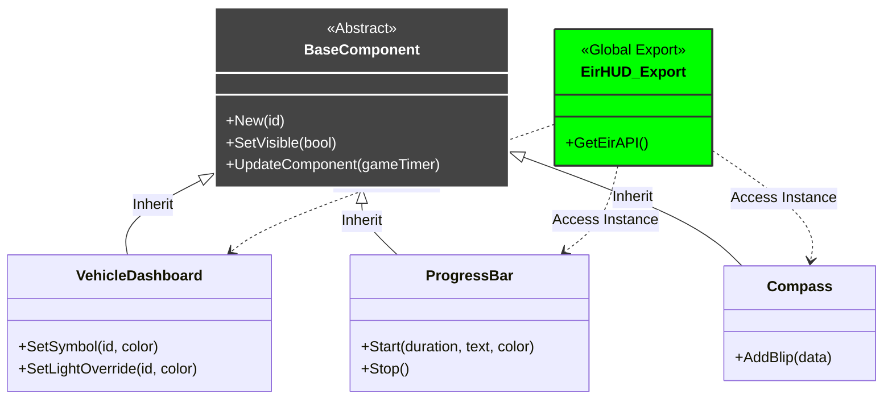

# EirHUD API

The **EirHUD API** provides developers with full control over **every single component** of the interface.
Nothing is hidden: if it's on the screen, you can control it via code; if it's hidden, you can toggle it. The API structure mirrors the configuration structure, making it intuitive to find the module you need.

The system is designed to be:
- **Zero-Latency:** Direct communication with the Scaleform engine.
- **Framework Agnostic:** While it auto-detects ESX/QB, you can override any data manually.
- **Priority-Based:** Modules like the Dashboard allow you to "force" states (e.g., check engine light) over game data.

## What’s Included

Every component listed below exposes its own set of methods:

### 🚗 Vehicle & Navigation
- **Vehicle Dashboard** – Full control over speed, RPM, fuel, and specific warning lights overrides.
- **Compass** – Manage dynamic blips, heading, and visibility.
- **World Markers** – Project 3D coordinates onto the screen (for pings, mission objectives).

### 🎒 Interaction & Items
- **Reserved Slots** – A dynamic Hotbar (up to 10 slots) for items, weapons, or actions.
- **Equipped Weapon** – Display the currently held weapon info.
- **Fixed Interaction** – A static panel for contextual keybinds (e.g., "Press E to interact").
- **Progress Bar** – Timed action bars for crafting or interactions.

### 📊 Status & Info
- **Status Bars** – Control Health, Armor, Hunger, Thirst, and Stress values.
- **Server Info** – Update text labels for Job, Cash, Bank, and ID.
- **Server Logo** – Control the server branding and its animations.
- **Notifications** – A complete feed system for advanced alerts.

### 🎙️ Audio
- **Audio Voice** – Control the voice proximity indicator.
- **Audio Radio** – Manage the list of active radio speakers.

## Architecture Overview

EirHUD utilizes an Object-Oriented structure. Every specific module inherits from a `BaseComponent` class, ensuring consistent behavior for visibility and updates, while adding its own unique API methods.
Components are contained in a main HUD class handled as a component on its own internally.



---

## 🎨 Dynamic Asset Loading

EirHUD exposes a powerful runtime texture dictionary named **`aesir_eir`**.
This feature allows you to use custom `.png` images (local) or **GIFs/Images from URLs** (remote) without needing to manually compile and stream `.ytd` files.


### Configuration
In your `fxmanifest.lua`, look for the `file_set 'textures'` block.
You can add your custom assets here.

{: .warning}
> **⚠️ Important:** Globbing (e.g., `textures/*.png`) is **not** supported. You must list files individually.

```lua
file_set 'textures' {
  -- 1. Local PNG Files
  -- Place these in the "textures/" folder of the script.
  -- The API Name will be the filename without extension.
  'textures/armor.png',           -- API Name: "armor"
  'textures/water_bottle.png',    -- API Name: "water_bottle"
  'textures/inventory_bag.png',   -- API Name: "inventory_bag"

  -- 2. Remote URLs (DUI)
  -- These are loaded as web textures.
  -- The API Name is generated incrementally: "dui_1", "dui_2", etc.
  'https://media.giphy.com/media/example/giphy.gif' -- API Name: "dui_1"
}
```

### Usage in Code
When using API methods that require a texture (like `ReservedSlots`, `EquippedWeapon`, or `ServerLogo`), use:
* **TXD:** `"aesir_eir"`
* **TXN:** The filename (e.g., `"armor"`) or the DUI index (e.g., `"dui_1"`).

```lua
-- Example: Displaying a local custom icon in the Hotbar
exports['eir_hud']:GetReservedSlotsAPI().UpdateSlot(1, {
    txd = "aesir_eir",
    txn = "water_bottle", -- Matches 'textures/water_bottle.png'
    amount = 1
})
```

---

## Quick Example

There are 2 ways to use the HUD.

### Method 1: The Global Object
Retrieve the whole API object and target specific modules by name.

```lua
-- 1. Get the Main API Object
local EirAPI = exports['eir_hud']:GetEirAPI()

-- 2. Example: Trigger a Progress Bar
EirAPI.ProgressBar.Start(5000, "Repairing Vehicle...", SColor.FromRandomValues())

-- 3. Example: Force an Icon in the Hotbar (ReservedSlots)
EirAPI.ReservedSlots.UpdateSlot(1, {
    txd = "aesir_eir", -- Using the dynamic runtime dictionary
    txn = "bandage",
    amount = 5,
    enabled = true
})

-- 4. Example: Update Server Info manually
EirAPI.ServerInfo.UpdateLabel(1, "Job: Police - Chief")
```

### Method 2: Direct Component Exports
Retrieve single components via their specific exports.

```lua
local compass = exports['eir_hud']:GetCompassAPI()
local slots = exports['eir_hud']:GetReservedSlotsAPI()
local info = exports['eir_hud']:GetServerInfoAPI()

compass.ShowComponent()
slots.UpdateSlot(1, { txn = "bandage", amount = 5, enabled = true })
info.UpdateLabel(1, "Job: Police - Chief")
```

Explore the sub-pages to see the specific functions for each component.